# Brain Train Game

For my Milestone 2 project I created an interactive brain training game which tests your brains short term memory. I created something that is generally fun but can be used as a compettion style task where, if you complete the challenge, you gain a ticket to a larger competition.

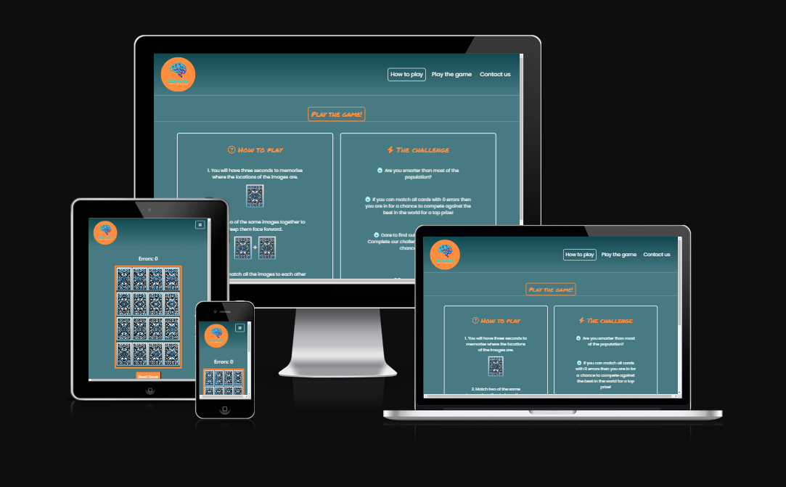

## Table of Contents

1. [Planning & Development](#planning--development)
2. [Features](#features)
3. [Testing](#testing)
4. [Deployment](#deployment)
5. [Languages](#languages)
6. [Media Queries](#media-queries)
7. [Software](#software)
8. [Code](#code)
9. [Credits](#credits)

# Planning & Development #

### Site Purpose
This game has been created for the main purpose of entertainment and brain training. It can also be used as a pre-challenge to a greater competition.

### Target audience

This game is aimed towards people who like challenging games and the thrill of winning a competition.

### User Needs

### User stories
1. User wants a fun game to pass the time.

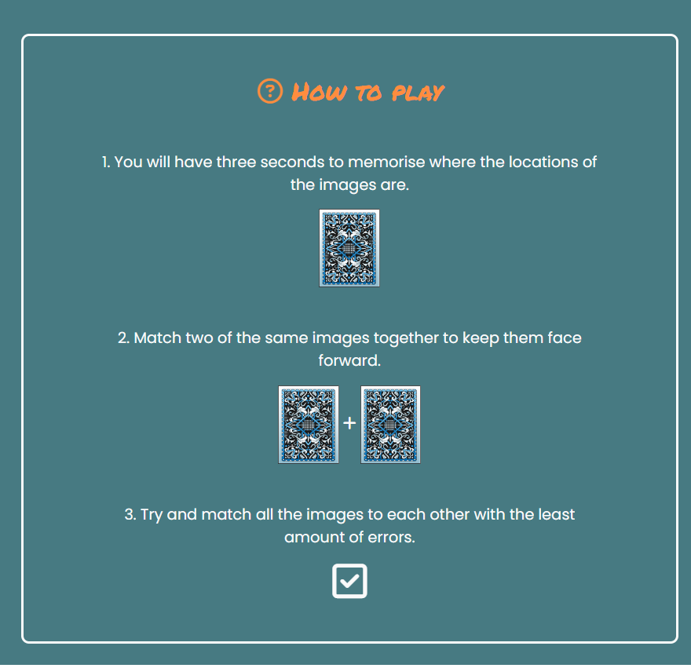

The user gets interactive instruction son how to play the game and what the basic aim is.

2. A more challenging experience for the more determined user.

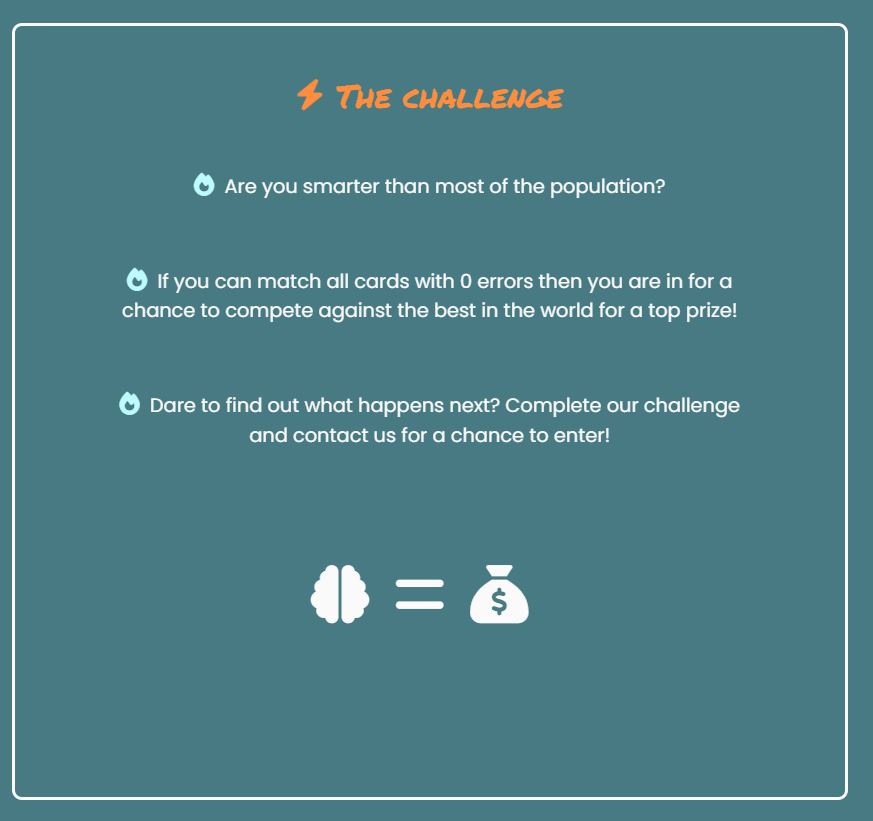

The user gets instructions on how to complete the challenge and what to do next.

3. The user will then, either way, play the game.

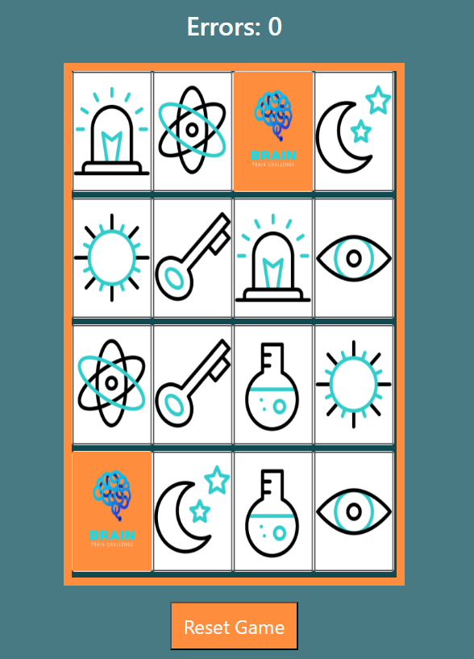

The user will see the cards for 3 seconds only. They will then try and complete the game with as few errors as possible.
When they complete the game they will get a congratulations popup.

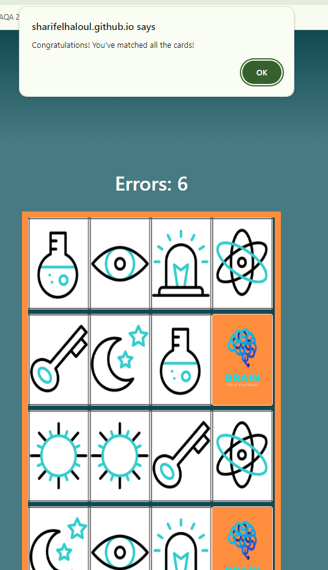

If they have completed the challenge and want more information they can use the contact us page and input their details.

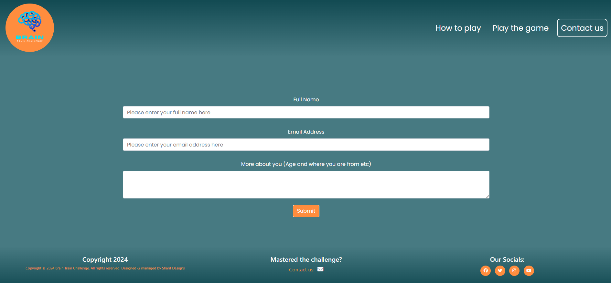

### Site Objectives

* Test users short term memory skills.
* Be a competitive experience where users compete against eachother for the fewest errors.
* Give a positive user experience with an eye catching colour theme.
* An easy experience which is quick to pick up and play.
* Easy to navigate and find key information.
* Accessible for screen readers.
* Reset the game easily.
* Links to all social media easily accessible from the footer.

### Approach
 
 * User experience will be carefully planned and designed with the flow of the site being considered at all times.
 * The site will provide users with easy links to access all my social media accounts.
 * The site content will be family-friendly and sccessible to all.
 * The game will be visually stimulating and interesting for the user.

 ### Research

 I looked at other javascript games to see what can be done using just javascript and how I could incorperate these skills into my own recently aquired knowledge.

 Sites included:
 * [Lumosity Brain Training](https://www.lumosity.com/en/)
 * [Tricky cups](https://www.improvememory.org/brain-games/memory-games/tricky-cups/)

 Thoughts for design:
 * Minimalist design.
 * Responsive.
 * Game to fit on page page.
 * Simple instructions
 * Clear navigation

 All of the thoughts above, I have included in my own design.

 ### Wireframes

 I used Balsamiq to plan and design my wireframes and user journey. I have changed some elements along the way that differ from the original design such as the mobile dropdwon Menu.

 ### Mobile Design Wireframe

 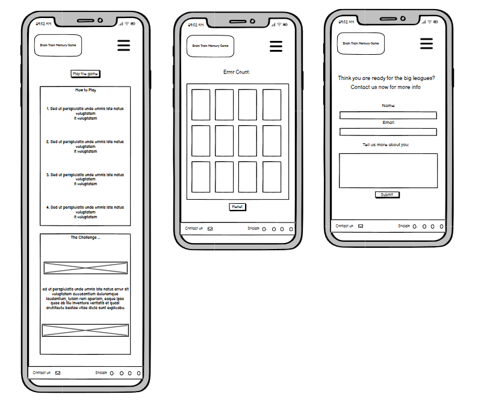

 ### Tablet Design Wireframe

 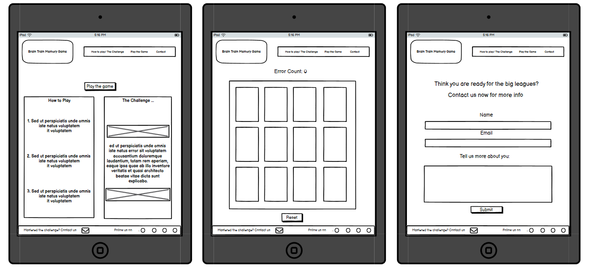

 ### Desktop Design Wireframe

 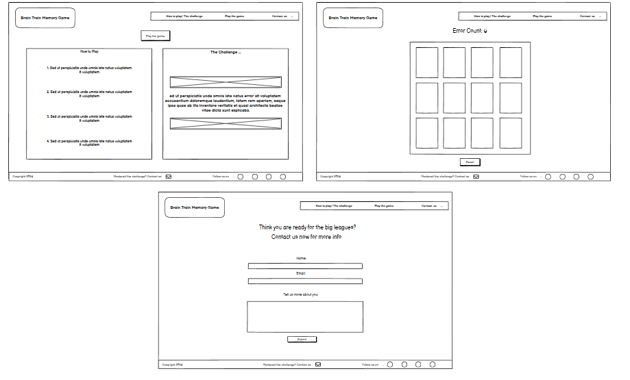

 ### Colour Scheme

 After looking at some relaxing brain related sites I decided om a relaxing tone of blues with a bright pop of orange to mimic a brain wave in the sea of tranquility.

 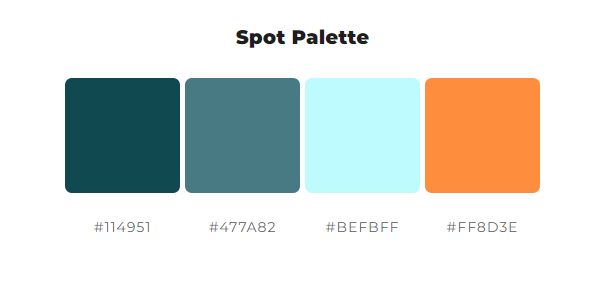

 ### Typography

 I chose a calm neutral font for most of the elements. For some of the smaller headings I used a more game like font to help with the pop of orange colour.

 ### Javacript code layout

 I chose to keep my game Javascript code seperate to make sure that any future collaborator may be able to access it and change things easily. I have also labelled and commented on each function to make sure it is as accessible as possible.

 # Features #

 ### General

 * My site is fully responsive and can be used easily on all screen sizes 320px width.
 * I have made sure that readability is contrasted carefully for all visual elements.
 * I have used a Favicon to keep up the rest of the sites aesthetic.

 

 ### Logo

 

 * I created my simple logo using Canva.com and matched the colours to create a cohesive effect.

 ### Instructions page

 

 * I made a nice and easy initial page that clearly lists the instructions and the challenge rules.

 ### Navigation bar

 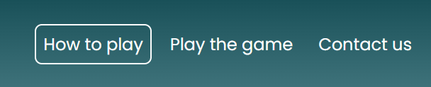

 * I have created an easy and nicely visible navigation bar has a changing border around the selected page.

 ### Footer

 

 * I have created a detailed and colour coordinated footer that allows the reader to jump to the contact page using the envelope icon. It also allows the user to access all our social media via the other four icons.

 

 * I have created am interactive page with a fun memeory card game. The cards flip over for three seconds then the user has to find as many matches as possible with as few errors as possible.

 

 * I have created a page that contains a fully functional form to fill in to contact us if the user manages to complete the challenge set. The page automatically redirects to the thank you page when the form has been completed correctly. If the user makes an error they will then get redirected over to the 404 error page.

 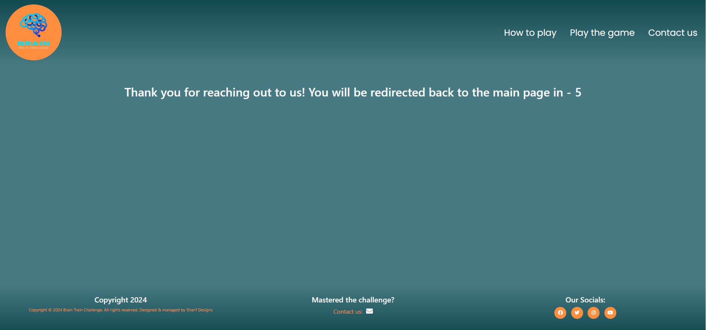

 * I have created a thank you page for the user after they have completed the initial form. It uses javascript to redirect the user back to the hom epage after 5 seconds.

 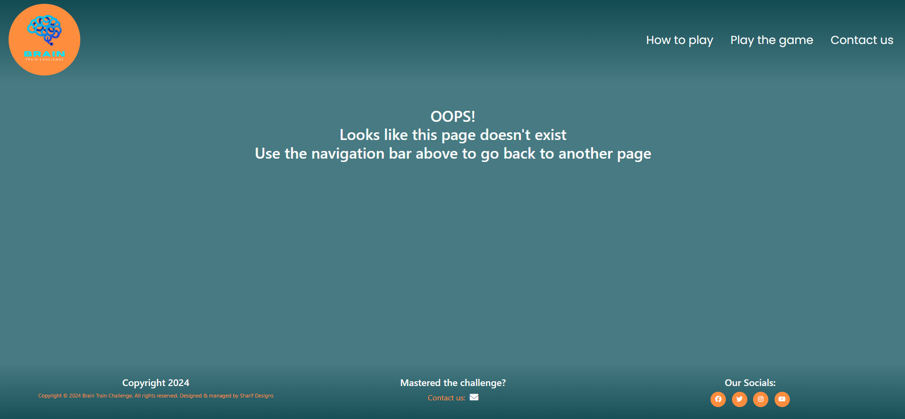

 * I have created an error page should anything go wrong for the user. I have included a message so that they can use the navigation bar to go page to the main page.

 ## Possible future features

 * Sounds for the cards when they flip
 * Animation for when the player completes the challenge

 # Testing

 ## Testing during development

 * Throughout the process of making this website, I tested my code using the preview window extension within VS Code and in the chrome browser. With chrome browser I could use Chrome Developer Tools troubleshoot any spacing issues in the CSS or Javascript bugs within the console log.
* I would also consistently commit and push work to Github to then view live site and check responsiveness on my mobile and tablet devices, as well as passing onto friends and family to test on their devices.
* I have also tested my site in the main browsers available, which include:

  * Google Chrome
  * Mozilla Firefox
  * Apple Safari
  * Microsoft Edge

  ### Testing the home page

  I made sure to test all elements of my website to make sure that it all works onsistently across all browsers and devices. On my home page this included:

  * Logo
    * **Expected** Clickable and will always bring you back to homepage.
    * **Tested** Clicked from all parts of the site.
    * **Result** Always brought me back to the homepage.
    * **Action** None.

  * Nav bar
    * **Expected** Clickable and will always take you to the right page and will highlight current page.
    * **Tested** Clicked from all parts of the site.
    * **Result** Always brought me to the correct page and highlighted correct page.
    * **Action** None.

  * Card instructions image hover
    * **Expected** Hover over the first card which should reveal a card then flip back. Click on second set of card should flip over sna stay flipped over.
    * **Tested** hovered and clicked on all three cards.
    * **Result** Cards acted as they should.
    * **Action** None.

  * Footer mail icon
    * **Expected** Clickable and will always take you to the contact page.
    * **Tested** Clicked from all parts of the site.
    * **Result** Always brought me to the correct page.
    * **Action** None.

  * Footer social media icons
    * **Expected** Clickable and will always take you to the right social media page.
    * **Tested** Clicked from all parts of the site.
    * **Result** Always brought me to the correct social media platform.
    * **Action** None.

  * Game on load
    * **Expected** Game will load up with the correct amount of cards and will start with the cards flipping over to reveal themselves for three seconds.
    * **Tested** Loaded page up multiple times on all devices.
    * **Result** Worked exactly as expected.
    * **Action** None.

  * Game when being played
    * **Expected** Cards are clickable and flip back when not correct or stay flipped when correct. Error counter should also count up whenever a mistake is made. Pop up message when game is completed.
    * **Tested** Clicked all cards on all devices.
    * **Result** Worked exactly as expected.
    * **Action** None.

  * Contact page
    * **Expected** User can fill in all elements properly. When user submits correct information should send to my email and user should be directed to the thank you page.
    * **Tested** Filled in with wrong information and correct information to make sure its works correctly.
    * **Result** Brought up.
    * **Action** None.

  * Thank you page
    * **Expected** Works properly when sent from the contact page. Redirects you to the hompage when the timer counts down from 5 seconds.
    * **Tested** Following on from contact page multiple times from all devices to make sure it works.
    * **Result** Worked exactly as expected.
    * **Action** None.

  * 404 page
    * **Expected** Directs you to the 404 page when form is misfilled or when the url is incorrect.
    * **Tested** Added random characters to the URL. 
    * **Result** Always brought me to the correct page with the correct error message
    * **Action** None.

## Bugs found and fixed during coding

1. could not seem to create a gap between two borders when using bootsrtap due to the gutter in between. I eventually solved this by adding an extra div inside the columns which allowed me to add padding to the borders and create two seperate boxes.

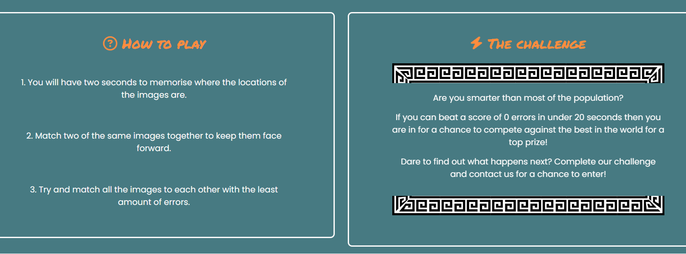

2. Was having an issue where the bottom border of the two divs would never line up no matter how much space was used in each div. Solved this by making the child fill 100% of the parent container.

```CSS
.how-to-text, .challenge-text  {
    color: #fafafa;
    text-align: center;
    padding: 50px 100px;
    font-size: 110%;
    font-family: "Poppins", sans-serif;
    border: 3px solid #fafafa;
    border-radius: 10px;
    height: 100%;
}
```

Before:

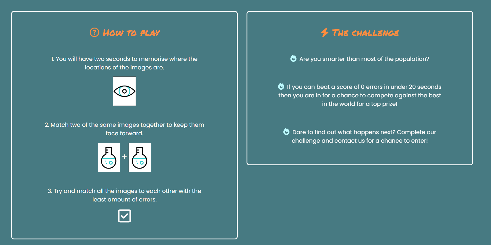

After:

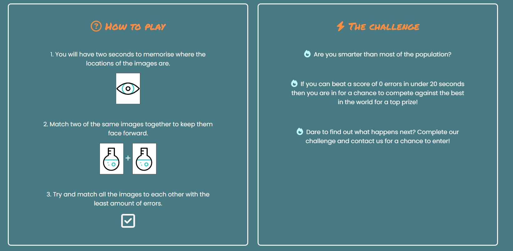

4. Was having an issue trying to transition betwene two images when hovering over it on the main page to instruct the player. With CSS i would have had to using background images to solve sthis issue so instead I decided to use javascript on the images to make them change on hover or stay flipped over.

```js
onmouseover="this.src='assets/images/eye.png';" onmouseout="this.src='assets/images/card-back.png';"
```

5. I was finding it diffult to find a way to count the number of succesful matches to add a popup message to say when the player had succesfully completed the match. I added this code to start with but found it was just counting second cards not successful matches:

```js
matches += 1;
            if (matches === cardList.length) {
                alert("You win!");
            }
```

After some research I found that the best way was to create a variable from scratch and create an 'else' for my update function which would then count the successful matches. When the succsessful matches  matches the card length string it would result in a win message using the following code:

```js
else {
        matches += 1;
        card1Selected = null;
        card2Selected = null;
        if (matches === cardList.length) {
            setTimeout(() => {
                alert("Congratulations! You've matched all the cards!")
            }, 500);
        }
       
    }
```

## Validator testing

### W3C Validator

I ran my site through the W3C validator and recieved the following 3 errors:

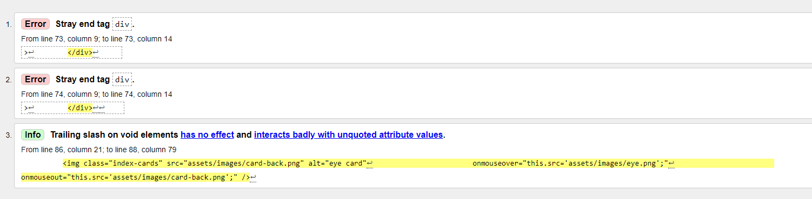

Fixed all three errors now result has no errors.

### CSS Jigsaw Validator

I ran my site through the CSS Jigsaw Validator and recieved this message showing no errors:

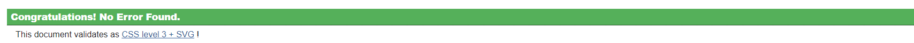

###


