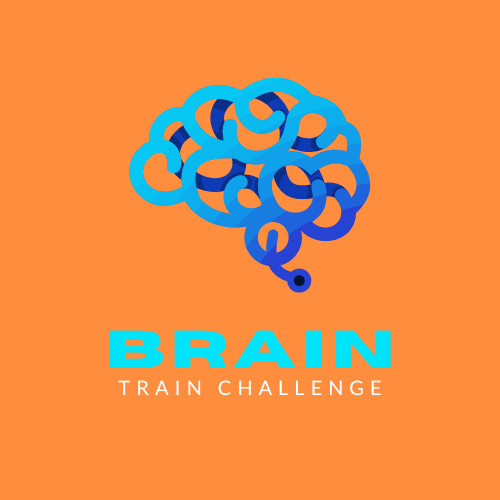

# Brain Train Game

For my Milestone 2 project I created an interactive brain training game which tests your brains short term memory. I created something that is generally fun but can be used as a compettion style task where, if you complete the challenge, you gain a ticket to a larger competition.


## Table of Contents

1. [Planning & Development](#planning--development)
2. [Features](#features)
3. [Testing](#testing)
4. [Deployment](#deployment)
5. [Languages](#languages)
6. [Media Queries](#media-queries)
7. [Software](#software)
8. [Code](#code)
9. [Credits](#credits)

# Planning & Development #

### Site Purpose
This game has been created for the main purpose of entertainment and brain training. It can also be used as a pre-challenge to a greater competition.

### Target audience

This game is aimed towards people who like challenging games and the thrill of winning a competition.

### User Needs

### User stories
1. User wants a fun game to pass the time.


The user gets interactive instruction son how to play the game and what the basic aim is.

2. A more challenging experience for the more determined user.


The user gets instructions on how to complete the challenge and what to do next.

3. The user will then, either way, play the game.


The user will see the cards for 3 seconds only. They will then try and complete the game with as few errors as possible.
When they complete the game they will get a congratulations popup.


If they have completed the challenge and want more information they can use the contact us page and input their details.


### Site Objectives

* Test users short term memory skills.
* Be a competitive experience where users compete against eachother for the fewest errors.
* Give a positive user experience with an eye catching colour theme.
* An easy experience which is quick to pick up and play.
* Easy to navigate and find key information.
* Accessible for screen readers.
* Reset the game easily.
* Links to all social media easily accessible from the footer.

### Approach
 
 * User experience will be carefully planned and designed with the flow of the site being considered at all times.
 * The site will provide users with easy links to access all my social media accounts.
 * The site content will be family-friendly and sccessible to all.
 * The game will be visually stimulating and interesting for the user.

 ### Research

 I looked at other javascript games to see what can be done using just javascript and how I could incorperate these skills into my own recently aquired knowledge.

 Sites included:
 * [Lumosity Brain Training](https://www.lumosity.com/en/)
 * [Tricky cups](https://www.improvememory.org/brain-games/memory-games/tricky-cups/)

 Thoughts for design:
 * Minimalist design.
 * Responsive.
 * Game to fit on page page.
 * Simple instructions
 * Clear navigation

 All of the thoughts above, I have included in my own design.

 ### Wireframes

 I used Balsamiq to plan and design my wireframes and user journey. I have changed some elements along the way that differ from the original design such as the mobile dropdwon Menu.

 ### Mobile Design Wireframe

 

 ### Tablet Design Wireframe

 

 ### Desktop Design Wireframe

 

 ### Colour Scheme

 After looking at some relaxing brain related sites I decided om a relaxing tone of blues with a bright pop of orange to mimic a brain wave in the sea of tranquility.

 

 ### Typography

 I chose a calm neutral font for most of the elements. For some of the smaller headings I used a more game like font to help with the pop of orange colour.

 ### Javacript code layout

 I chose to keep my game Javascript code seperate to make sure that any future collaborator may be able to access it and change things easily. I have also labelled and commented on each function to make sure it is as accessible as possible.

 # Features #

 ### General

 * My site is fully responsive and can be used easily on all screen sizes 320px width.
 * I have made sure that readability is contrasted carefully for all visual elements.
 * I have used a Favicon to keep up the rest of the sites aesthetic.

 

 ### Logo

 

 * I created my simple logo using Canva.com and matched the colours to create a cohesive effect.

 ## Instructions page

 


## Bugs found and fixed during coding

1. could not seem to create a gap between two borders when using bootsrtap due to the gutter in between. I eventually solved this by adding an extra div inside the columns which allowed me to add padding to the borders and create two seperate boxes.


2. Was having an issue where the bottom border of the two divs would never line up no matter how much space was used in each div. Solved this by making the child fill 100% of the parent container.

```CSS
.how-to-text, .challenge-text  {
    color: #fafafa;
    text-align: center;
    padding: 50px 100px;
    font-size: 110%;
    font-family: "Poppins", sans-serif;
    border: 3px solid #fafafa;
    border-radius: 10px;
    height: 100%;
}
```

Before:


After:


4. Was having an issue trying to transition betwene two images when hovering over it on the main page to instruct the player. With CSS i would have had to using background images to solve sthis issue so instead I decided to use javascript on the images to make them change on hover or stay flipped over.

```js
onmouseover="this.src='assets/images/eye.png';" onmouseout="this.src='assets/images/card-back.png';"
```

5. I was finding it diffult to find a way to count the number of succesful matches to add a popup message to say when the player had succesfully completed the match. I added this code to start with but found it was just counting second cards not successful matches:

```js
matches += 1;
            if (matches === cardList.length) {
                alert("You win!");
            }
```

After some research I found that the best way was to create a variable from scratch and create an 'else' for my update function which would then count the successful matches. When the succsessful matches  matches the card length string it would result in a win message using the following code:

```js
else {
        matches += 1;
        card1Selected = null;
        card2Selected = null;
        if (matches === cardList.length) {
            setTimeout(() => {
                alert("Congratulations! You've matched all the cards!")
            }, 500);
        }
       
    }
```

